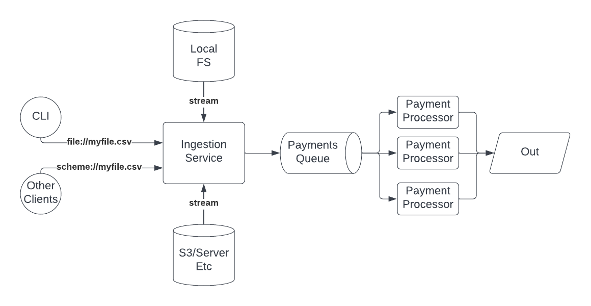

# Payments Engine

This is a small toy project for processing payment transactions from a CSV file.

The project showcases the Rust programming language and best practices related to code quality and testing.

## Design

This diagram shows the high level components of the application. Obviously for this exercise we don't have a truly distributed system but the concepts are meant to show the start of a scalable design.

For the purposes of this toy application, the CLI and local filesystem will be the only implemented path through the system.



* `CLI` is the main entry point of the application for the purposes of this toy project
* `Other Clients` is meant to show that other hypothetical clients can consume the ingestion api with different URI schemes 
* `Ingestion Service` exposes a URI based interface for submitting a payments CSV for processing
* Files can be read from either local filesystem or other storage mechanisms
* `Payments Queue` is a thread-safe mechanism to queue payments that are ready for processing
* `Payment Processor`'s are a pool of workers available to process payments and output results

## Other notes/comments

* The application is designed to be easily testable by using dependency injection and [SOLID](https://en.wikipedia.org/wiki/SOLID) principles
* The parallelism of the application was meant to show scalability and understanding of advanced Rust programming, but actually introduced a ton of complexity related to the chronological order of transactions.

## Usage example

Run with cargo:
```
$ cargo run -- transactions.csv > accounts.csv
```

Input: (trasnsactions.csv)
```
type,client,tx,amount
deposit,1,1,1.0
deposit,2,2,2.0
deposit,1,3,2.0
withdrawal,1,4,1.5
withdrawal,2,5,3.0
deposit,3,6,37.0
dispute,3,6,
chargeback,3,6,
dispute,1,1,
resolve,1,1,
```

Output (accounts.csv):
```
client,available,held,total,locked
3,0,0,0,true
2,2,0,2,false
1,1.5,0,1.5,false
```

## Requirements questions

* Truncate floats at 4 past decimal or round the value? (assuming rounding)
* Do client ID's need to match for disputed transactions? (assuming yes)
* Should accept "blank" values for disputes/chargebacks/resolves? (assuming yes)
* Can you dispute both deposits and withdrawals? (assuming yes, but this is a guess)
  * In case of disputing a deposit, subtract disputed amount from available and add to held
  * In case of disputing a withdrawal, add disputed amount to held but do not increase available